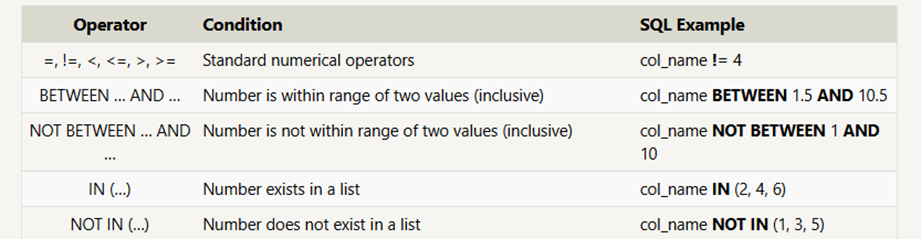
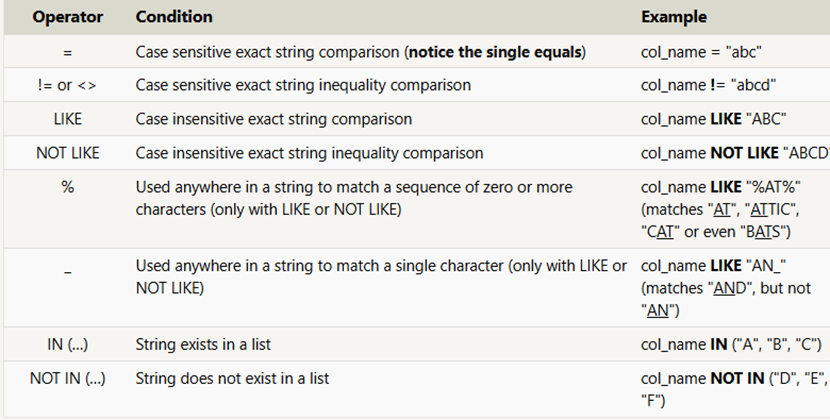
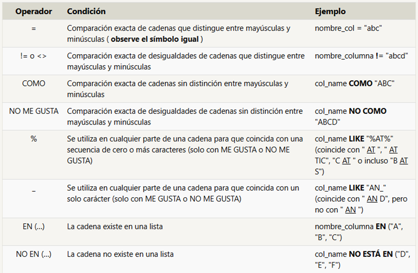

 # SQL
 ## Tabla de Contenido
- [SQL](#sql)
  - [Tabla de Contenido](#tabla-de-contenido)
  - [¿QUE ES SQL?](#que-es-sql)
  - [DIFERENCIAS ENTRE SQL Y NO SQL](#diferencias-entre-sql-y-no-sql)
      - [TABLA DE DIFERENCIAS ENTRE SQL Y NO SQL](#tabla-de-diferencias-entre-sql-y-no-sql)
    - [Páginas y aplicaciones para empezar el mundo SQL:](#páginas-y-aplicaciones-para-empezar-el-mundo-sql)
  - [CONCEPTOS BASE DE SQBOLT (SQL)](#conceptos-base-de-sqbolt-sql)
    - [Lesson 1: SELECT queries 101 (Consultas)](#lesson-1-select-queries-101-consultas)
    - [Lección 2 : Consultas con restricciones (Parte 1)](#lección-2--consultas-con-restricciones-parte-1)
      - [Operadores para restricciones básicas](#operadores-para-restricciones-básicas)
    - [Lección 3 : Consultas con restricciones (Parte 2)](#lección-3--consultas-con-restricciones-parte-2)
      - [Operadores específicos para datos de texto:](#operadores-específicos-para-datos-de-texto)
    - [Lección 4 : Filtrado y ordenación de resultados de consultas](#lección-4--filtrado-y-ordenación-de-resultados-de-consultas)
      - [Ordenar resultados](#ordenar-resultados)
      - [Limitar los resultados a un subconjunto](#limitar-los-resultados-a-un-subconjunto)
    - [Leccion 5 Revisión de SQL: Consultas SELECT simples](#leccion-5-revisión-de-sql-consultas-select-simples)
      - [Latitudes y longitudes](#latitudes-y-longitudes)
    - [Lección 6 : Consultas multitabla con JOIN](#lección-6--consultas-multitabla-con-join)
      - [Normalización de bases de datos](#normalización-de-bases-de-datos)
      - [Consultas multitabla con JOIN](#consultas-multitabla-con-join)

---


## ¿QUE ES SQL?

[ Es un lenguaje de Consulta Estructurado, es un lenguaje diseñado para permitir a usuarios, tanto técnicos como no técnicos, consultar, manipular y transformar datos de una base de datos relacional. Gracias a su simplicidad, las bases de datos SQL proporcionan almacenamiento seguro y escalable para millones de sitios web y aplicaciones móviles.]

---

>¿SABIAS?
>
>Existen muchas bases de datos SQL populares, como SQLite, MySQL, Postgres, Oracle y Microsoft SQL Server. Todas son compatibles con el estándar común del lenguaje SQL, que es lo que se enseñará en este sitio, pero cada implementación puede diferir en las características adicionales y los tipos de almacenamiento que admite.

Motor de base de datos: (mySQL, postgreSQL o SQLite)


## DIFERENCIAS ENTRE SQL Y NO SQL

**SQL** :  Base de datos relacional : lo que se intenta es optimizar y evitar la duplicidad de los datos de forma que creamos relaciones entre las tablas para evitar la duplicidad de los mismos datos. Tienen tablas y atributos.

**NO SQL** : Base de datos no relacional : en lugar de tener tablas, lo que tenemos son colecciones de documentos. Y ahí si lo que hacemos es duplicar los datos.

---
#### TABLA DE DIFERENCIAS ENTRE SQL Y NO SQL

|        SQL                   | NO SQL      |          
| -------------               | ------------- | 
| Tablas                      |Colecciones de documentos
|Relaciona los datos          |Puedes relacionar los documentos pero es más costoso           |
Evitar duplicidad             | Consultas más rápidas             
Evita la redundancia de datos |Normalizar los datos es problemático
Ocupan menos espacio  | Updates se tienen que hacer en todos los documentos
Hacer muchas consultas para recuperar toda la informacion que te interesa | la integridad de los datos no está garantizada
Maneja mucha coherencia | mucho más rápido y potente para consultas muy grandes|
____________________________________________________________

 ### Páginas y aplicaciones para empezar el mundo SQL:
-	MySQL
-	SQLite
-	https://sqlbolt.com/

## CONCEPTOS BASE DE SQBOLT (SQL)

### Lesson 1: SELECT queries 101 (Consultas)

Para recuperar datos de una base de datos SQL, necesitamos escribir sentencias **SELECT**, comúnmente conocidas como **consultas** . Una consulta es simplemente una sentencia que declara qué datos buscamos, dónde encontrarlos en la base de datos y, opcionalmente, cómo transformarlos antes de que se devuelvan. Sin embargo, tiene una sintaxis específica, que aprenderemos en los siguientes ejercicios.

Y dada una tabla de datos, la consulta más básica que podríamos escribir sería una que seleccione un par de columnas (propiedades) de la tabla con todas las filas (instancias).

``` (alt+96)
SELECT column,another_column,
FROM movies;
```


El resultado de esta consulta será un conjunto bidimensional de filas y columnas, efectivamente una copia de la tabla, pero sólo con las columnas que solicitamos.
Si queremos recuperar absolutamente todas las columnas de datos de una tabla, podemos utilizar la *abreviatura asterisco ( ) en lugar de enumerar todos los nombres de las columnas individualmente.

```SQL (alt+96)
SELECT *,
FROM movies;
```
___


-	El ”_*_” recupera todas las columnas de la tabla ( PERO PARA EN PRODUCCION SIEMPRE VAS A QUERES EVITARLO”) lo ideal es siempre especificar las columnas.

EJERCICIO:


1.	Find the title of each film 
```SQL  (alt+96)
SELECT Title FROM movies;
```
2.	Find the title and director of each 
```SQL
SELECT Title, director FROM movies;   
```
> para unir otra columna usamos ","

### Lección 2 : Consultas con restricciones (Parte 1)

Ahora sabemos cómo seleccionar columnas específicas de datos de una tabla, pero si tuviera una tabla con cien millones de filas de datos, leer todas las filas sería ineficiente y quizás hasta imposible.
Para filtrar ciertos resultados, necesitamos usar una cláusula **WHERE** en la consulta. Esta cláusula se aplica a cada fila de datos comprobando los valores de cada columna para determinar si deben incluirse en los resultados.

```SQL (alt+96)
SELECT column,another_column,
FROM mytable
WHERE condition
     AND/OR another_condition
     AND/OR...;

```
---
#### Operadores para restricciones básicas
IN, NOT IN, BETWEEN

Se pueden construir cláusulas más complejas uniendo varias **AND** palabras **OR** clave lógicas (p. ej., núm_ruedas >= 4 Y puertas <= 2). A continuación, se presentan algunos operadores útiles para datos numéricos (p. ej., enteros o de punto flotante):

>Como ya habrás notado, SQL no requiere que escribas todas las palabras clave en mayúscula, pero como convención, ayuda a las personas a distinguir las palabras clave de SQL de los nombres de columnas y tablas, y hace que la consulta sea más fácil de leer.

EJERCICIOS

1.	Find the movie with a row id of 6:
```SQL
SELECT title FROM movies where id = 6;   
```
2.	Find the movies released in the years between 2000 and 2010: 
```SQL
SELECT * FROM movies WHERE year BETWEEN 2000 AND 2010;   
```
3.	Find the movies not released in the years between 2000 and 2010:
```SQL
SELECT * FROM movies WHERE year NOT BETWEEN 2000 AND 2010;
```
4.	Find the first 5 Pixar movies and their release year 
```SQL
SELECT * FROM movies where id IN (1,2,3,4,5);
OR
SELECT * FROM movies WHERE Id BETWEEN 1 AND 5;
```
### Lección 3 : Consultas con restricciones (Parte 2)
Al escribir cláusulas **WHERE** con columnas que contienen datos de texto, SQL admite varios operadores útiles para realizar tareas como la comparación de cadenas sin distinción entre mayúsculas y minúsculas y la coincidencia de patrones con comodines. 

#### Operadores específicos para datos de texto:
 LIKE,NOT LIKE,%,-,<>,=


>Cabe destacar que, si bien la mayoría de las implementaciones de bases de datos son bastante eficientes al usar estos operadores, es mejor dejar la búsqueda de texto completo en manos de bibliotecas especializadas como *Apache Lucene* o *Sphinx* . Estas bibliotecas están diseñadas específicamente para realizar búsquedas de texto completo y, por lo tanto, son más eficientes y admiten una mayor variedad de funciones de búsqueda, como la internacionalización y las consultas avanzadas.

EJERCICIO:
1.	Find all the Toy Story movies:
```SQL
 SELECT * FROM movies WHERE Title LIKE "Toy Story%";
 ```
 2.	Find all the movies directed by John Lasseter:
 ```SQL
  SELECT * FROM movies WHERE Director ="John Lasseter";
  OR
  SELECT * FROM movies WHERE Director LIKE "john lasseter";(este es mas flexible y mejor pero tiene costo)
  ```
3.	Find all the movies (and director) not directed by John Lasseter:
```SQL
 SELECT * FROM movies WHERE not Director ="John Lasseter";
 OR 
 SELECT * FROM movies WHERE director  !="John Lasseter";
 ```
4.	Find all the WALL-* movies:
```SQL
 SELECT * FROM movies WHERE title LIKE "%WALL-%";
 ```
 ### Lección 4 : Filtrado y ordenación de resultados de consultas
 SQL ofrece una forma práctica de descartar filas con un valor de columna duplicado mediante la  palabra clave **DISTINCT**.

```SQL (alt+96)
SELECT DISTINCT column,another_column,
FROM mytable
WHERE  condition(s);
```
 ---
#### Ordenar resultados

Para ayudar con esto, SQL proporciona una manera de ordenar los resultados por una columna determinada en orden ascendente o descendente utilizando la  cláusula **ORDER BY** .

```sql (alt+96)
SELECT column,another_column,
FROM mytable
WHERE conditions(s)
ORDER BY column AS/DESC;
```
>
>Al especificar una cláusula **ORDER BY**, cada fila se ordena alfanuméricamente según el valor de la columna especificada. En algunas bases de datos, también se puede especificar una intercalación para ordenar mejor los datos que contienen texto internacional.

#### Limitar los resultados a un subconjunto

Otra cláusula que se usa comúnmente con la cláusula **ORDER BY** es la cláusula " **LIMIT** y **OFFSET**", que es una optimización útil para indicar a la base de datos el subconjunto de resultados que le interesa.
        
-"" **LIMIT** .reducirá el número de filas a devolver" y

-"" opcional" **OFFSET** especificará desde dónde empezar a contar las filas.

```SQL (alt+96)
SELECT column,another_column,
FROM mytable
WHERE condition(s)
ORDER BY column AS/DESC
LIMIT num_limit OFFSET num_offset;
```


Si piensas en sitios web como Reddit o Pinterest, la página principal es una lista de enlaces ordenados por popularidad y fecha de publicación, y cada página posterior puede representarse mediante conjuntos de enlaces en diferentes puntos de la base de datos. Con estas cláusulas, la base de datos puede ejecutar consultas de forma más rápida y eficiente, procesando y devolviendo únicamente el contenido solicitado.

>¿Sabías?
>
>Si tiene curiosidad sobre cuándo se aplican las cláusulas " **LIMIT** y" **OFFSET** en relación con las demás partes de una consulta, generalmente se aplican al final, después de aplicar las demás cláusulas.

EJERCICIO:
1.	List all directors of Pixar movies (alphabetically), without duplicates:
```SQL
 SELECT DISTINCT Director FROM movies ORDER BY Director;
 ```
2.	List the last four Pixar movies released (ordered from most recent to least):
```SQL
SELECT * FROM movies ORDER BY year DESC LIMIT 4; 
OR
 SELECT id,Title,year FROM movies WHERE year ORDER BY year DESC LIMIT 4;
 ```
3.	List the first five Pixar movies sorted alphabetically:
```SQL
 SELECT * FROM movies ORDER  BY title ASC LIMIT 5; 
 OR
 SELECT Title,year FROM movies ORDER BY Title ASC LIMIT 5;
 ```
4.	List the next five Pixar movies sorted alphabetically:
```SQL
 SELECT Title,year FROM movies ORDER BY Title ASC LIMIT 5 OFFSET 5;
 ```

### Leccion 5 Revisión de SQL: Consultas SELECT simples
Ahora necesitas practicar escribiendo consultas que resuelvan problemas REALES.

#### Latitudes y longitudes
Las latitudes positivas corresponden al hemisferio norte y las longitudes positivas al hemisferio oriental(east). Dado que América del Norte se encuentra al norte del ecuador y al oeste del meridiano de Greenwich, todas las ciudades de la lista tienen latitudes positivas y longitudes negativas.

OESTE = WEST =OCCIDENTE

ESTE= EAST=ORIENTE
 
 EJERCICIO:

 
1.	Enumere todas las ciudades canadienses y sus poblaciones:
```SQL
=SELECT * FROM north_american_cities WHERE Country = "Canada";
```
2.	Order all the cities in the United States by their latitude from north to south:
```SQL
 SELECT * FROM north_american_cities WHERE Country = "United States" ORDER BY Latitude DESC;
 ```
3.	List all the cities west of Chicago, ordered from west to east:
```SQL
SELECT *FROM north_american_cities WHERE Longitude <-87.69 ORDER BY Longitude ASC;
```
4.	List the two largest cities in Mexico (by population):
```SQL
SELECT *FROM north_american_cities                
WHERE Country ="Mexico"AND population >=1742000
```
5.	List the third and fourth largest cities (by population) in the United States and their population:
```SQL
SELECT * FROM north_american_citiesWHERE Country ="United States" ORDER BY population DESC
LIMIT 2 OFFSET 2;
```

### Lección 6 : Consultas multitabla con JOIN
Hasta ahora, hemos estado trabajando con una sola tabla, pero los datos de entidades en el mundo real a menudo se dividen en partes y se almacenan en múltiples tablas ortogonales mediante un proceso conocido como **normalización**.


 
#### Normalización de bases de datos
La normalización de bases de datos es útil porque **minimiza la duplicación de datos en una sola tabla** y permite que los datos de la base de datos crezcan independientemente unos de otros . Como contrapartida, las consultas se vuelven ligeramente más complejas, ya que deben poder encontrar datos de diferentes partes de la base de datos, y pueden surgir problemas de rendimiento al trabajar con muchas tablas grandes.

Para responder preguntas sobre una entidad que tiene datos que abarcan varias tablas en una base de datos normalizada, **necesitamos aprender a escribir una consulta que pueda combinar todos esos datos y extraer exactamente la información que necesitamos.**

#### Consultas multitabla con JOIN
Las tablas que comparten información sobre una sola entidad deben tener una clave principal que la identifique de forma única en la base de datos. 
**Un tipo común de clave principal es:**
>-	**un entero autoincrementable**(porque optimiza el espacio), 
>>-	**pero también, puede ser una cadena o un valor hash, siempre que sea único.**

Al usar la cláusula **JOIN** en una consulta, podemos combinar datos de filas de dos tablas independientes usando esta clave única. La primera de las uniones que presentaremos es la **INNER JOIN**.
// Consulta de selección con INNER JOIN en varias tablas


